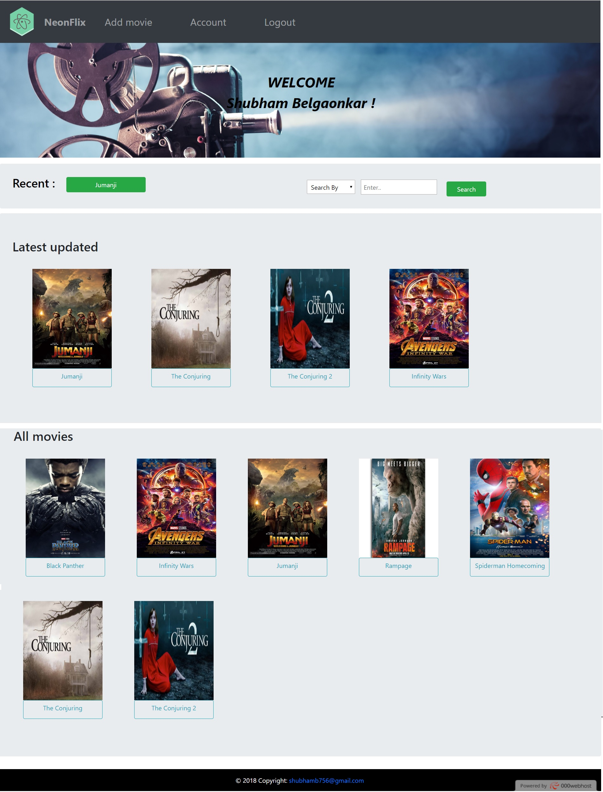
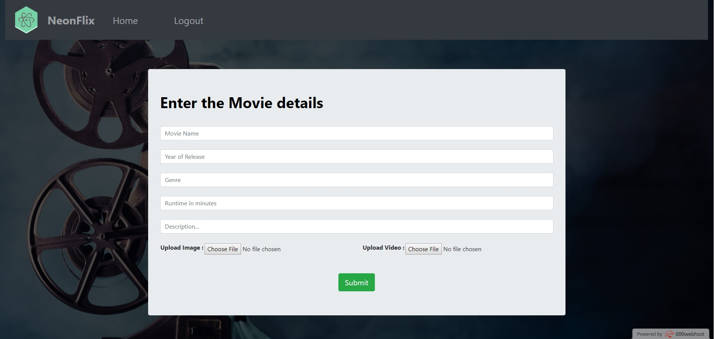
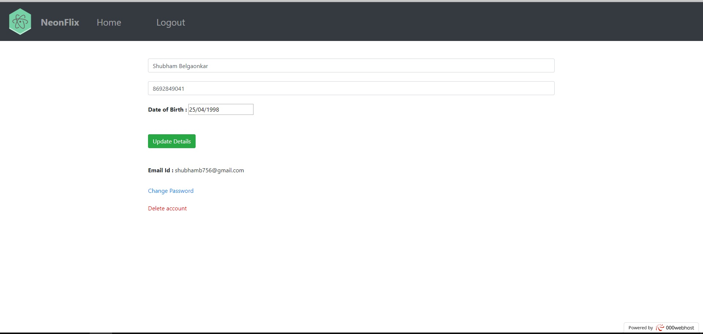
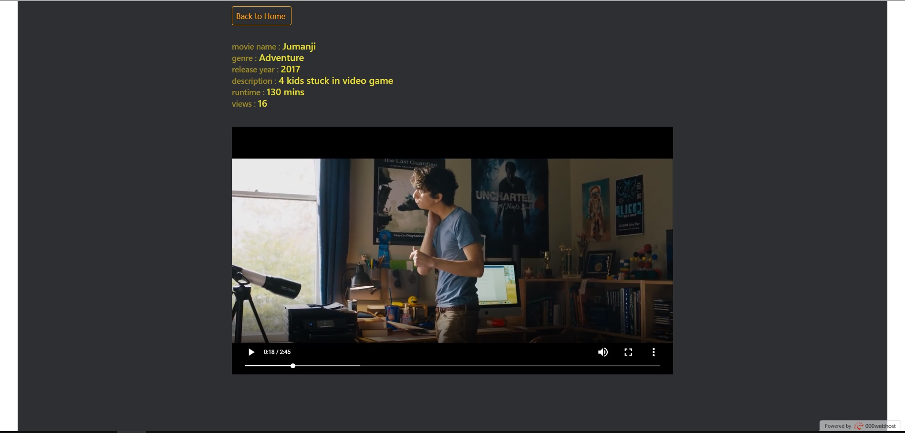

# Movie Recommendation System 🎬
A PHP-based Movie Recommendation System that suggests movies to users based on various criteria. This project utilizes collaborative filtering and content-based filtering techniques to provide personalized movie recommendations.

# Table of Contents:
           About the Project
           Features
           Technologies Used
           Getting Started
           Installation
           Usage
           Project Structure
           Contributing
           License
# About the Project
The Movie Recommendation System aims to provide users with personalized movie recommendations. The system is built using PHP and MySQL, allowing users to receive recommendations based on their preferences and previous interactions. This project is an excellent starting point for anyone looking to understand how recommendation engines work.

# Features:
           User Authentication: Secure login and registration system.
           Movie Recommendations:
           Collaborative filtering based on user ratings.
           Content-based filtering based on movie genres, cast, or directors.
           Rating System: Users can rate movies, improving recommendation accuracy.
           Search Functionality: Quickly find specific movies or genres.
           Watchlist: Add movies to a personal watchlist.
           Admin Panel: Manage movies, users, and ratings.
           Technologies Used
           Frontend: HTML, CSS, JavaScript, Bootstrap
           Backend: PHP
           Database: MySQL

# Prerequisites:
Make sure you have the following installed:

           PHP (>= 7.0)
           MySQL
           Apache or any server capable of running PHP (e.g., XAMPP)

# Screenshots :

**Homepage**

**Admin page**

**User page**

**Movie page**

**movie**

